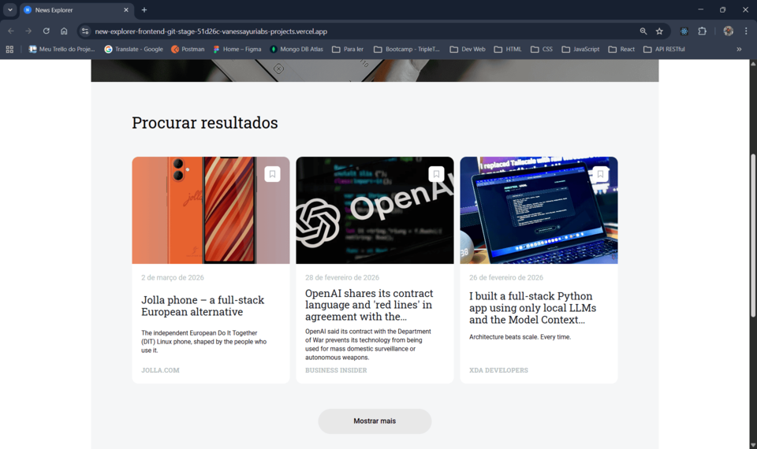
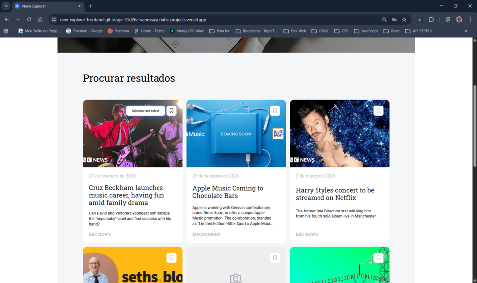
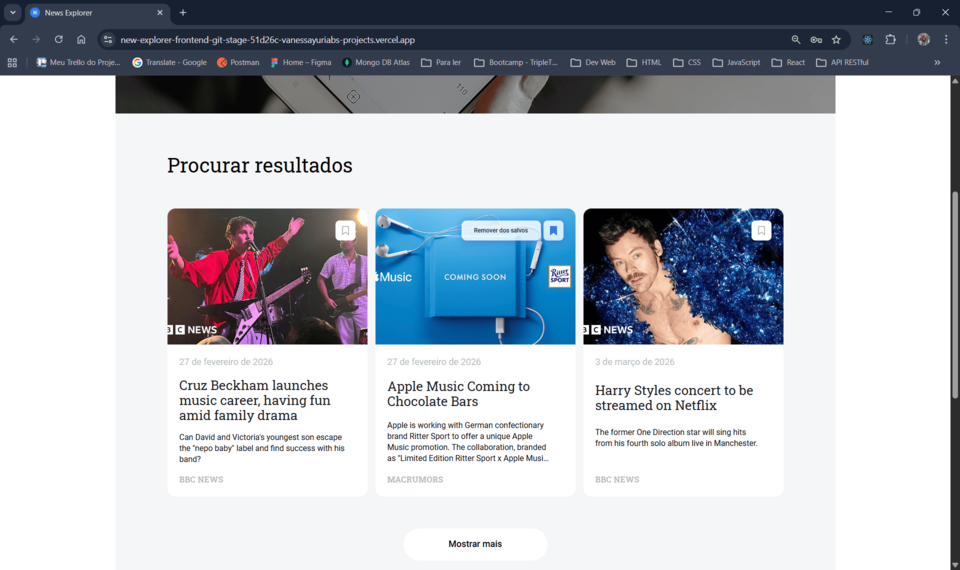
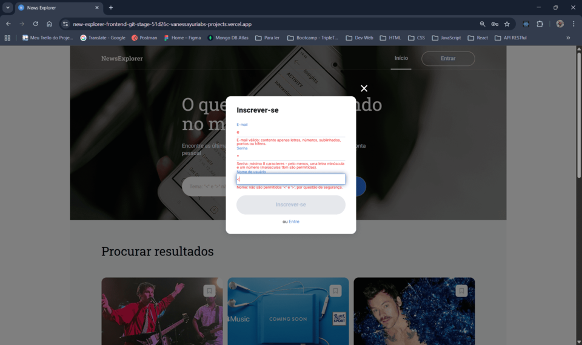
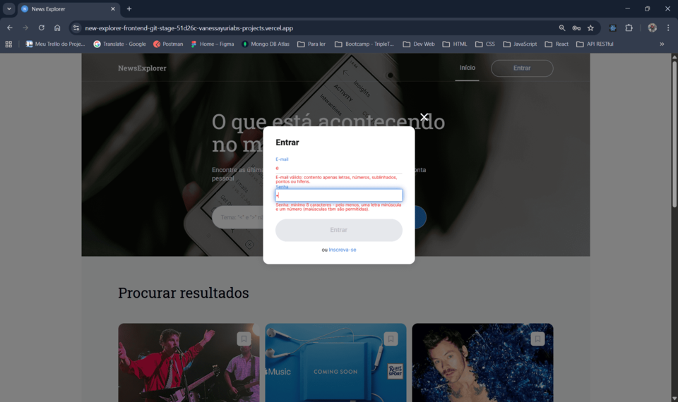
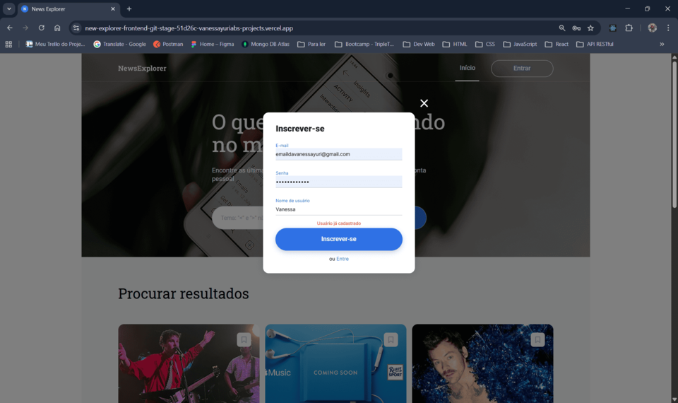
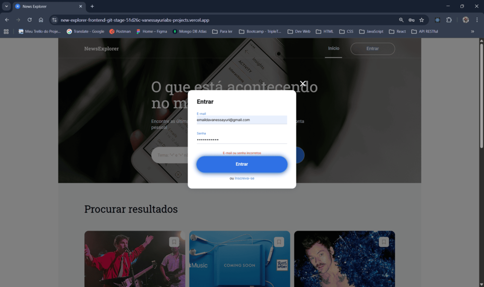
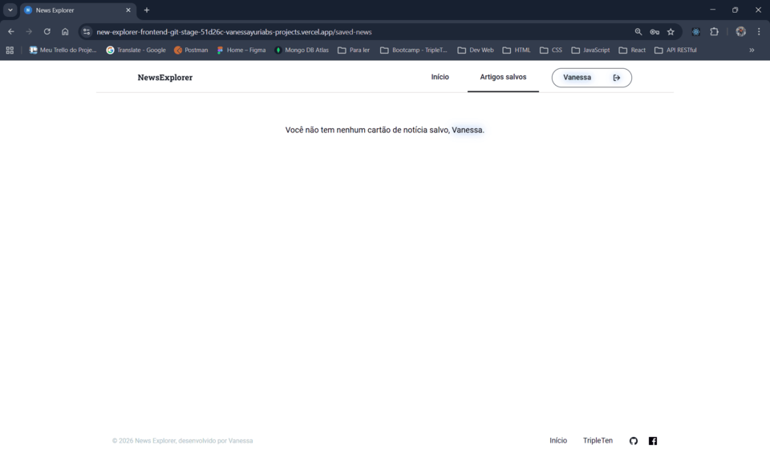
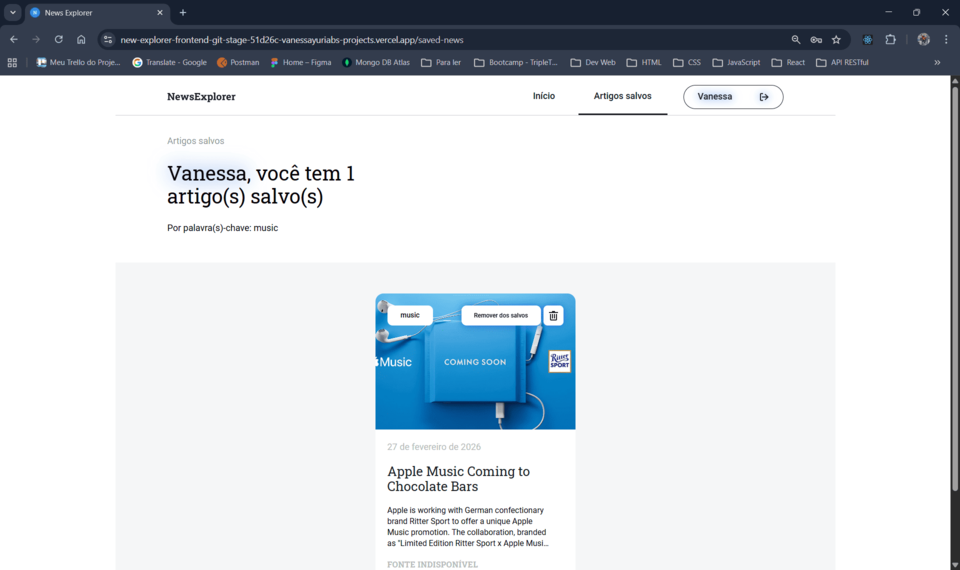

# 🅽 Projeto Final - Web Project News Explorer

Aplicação **full‑stack** para pesquisa e salvamento de notícias, com autenticação JWT, arquitetura desacoplada e foco em boas práticas de React e UX. Desenvolvida como projeto final do bootcamp **TripleTen**, dividida em fases incrementais, com foco em **React**, **Vite**, **Node.js**, **Express**, **MongoDB** e **autorização baseada em JWT**.

<!-- ⚙️ Stack principal -->

[](https://nodejs.org/pt)
[](https://developer.mozilla.org/docs/Web/JavaScript)
[](https://react.dev/)
[](https://vitejs.dev/)

<!-- 🧰 Qualidade de código e workflow -->

[](https://www.npmjs.com/package/eslint-config-airbnb)
[](https://prettier.io/)
[](https://editorconfig.org/)
[](https://typicode.github.io/husky/)
[](https://github.com/okonet/lint-staged)

<!-- 💾 Infraestrutura e deploy -->

[](https://git-scm.com/)
[](https://github.com/VanessaYuriAB/web_project_api_full)
[](https://vercel.com)

<!-- 🌍 Compatibilidade -->

[]()

---

<a id="top"></a>

## 📑 Índice

1. [Descrição 📚](#-1-descrição)
2. [Arquitetura do Projeto 🧱](#-2-arquitetura-do-projeto)
3. [Decisões Técnicas Relevantes ⚖️](#-3-decisões-técnicas-relevantes)
4. [Fases do Desenvolvimento 🧩](#-4-fases-do-desenvolvimento)
5. [Funcionalidades Implementadas 🚀](#-5-funcionalidades-implementadas)
6. [Autorização e Autenticação 🔐](#-6-autorização-e-autenticação)
7. [Gerenciamento de Estado Global 🧠](#-7-gerenciamento-de-estado-global)
8. [Proteção de Rota 🛡️](#-8-proteção-de-rota)
9. [Validação de Formulários ✅](#-9-validação-de-formulários)
10. [Tratamento de Erros ⚠️](#-10-tratamento-de-erros)
11. [Estrutura do Projeto 🗃️](#-11-estrutura-do-projeto)
12. [Instalação e Execução 📦](#-12-instalação-e-execução)
13. [Status do Projeto 🚧](#-13-status-do-projeto)
14. [Capturas de Tela 📸](#-14-capturas-de-tela)
15. [Demonstração 🎥](#-15-demonstração)
16. [Melhorias 📈](#-16-melhorias)
17. [Aprendizados Técnicos 📘](#-17-aprendizados-técnicos)
18. [Autora 👩‍💻](#-18-autora)

---

<a id="-1-descrição"></a>

## 📚 1. Descrição

O **News Explorer** é uma aplicação web full‑stack que permite aos usuários:

- Pesquisar notícias a partir de palavras‑chave (API de terceiros: https://newsapi.org)
- Criar conta e autenticar‑se
- Salvar e remover artigos associados ao seu perfil
- Acessar uma área protegida com artigos salvos

O projeto foi desenvolvido em **fases incrementais**, seguindo os critérios técnicos e de qualidade exigidos pelo bootcamp da **TripleTen**.

📌 A busca de notícias, **em produção**, utiliza o **proxy** fornecido pela escola para evitar problemas de CORS em navegadores - _comportamento validado em Chrome, Edge e Firefox (via BrowserStack)_. Em produção real, essa integração seria feita pelo backend da aplicação.

[Voltar ao topo 🔝](#top)

---

<a id="-2-arquitetura-do-projeto"></a>

## 🧱 2. Arquitetura do Projeto

- **Frontend**: React + Vite (deploy independente)
- **Backend**: Node.js + Express + MongoDB
- **Autenticação**: JWT
- **Comunicação**: API REST via fetch
- **Deploy**:
  - Frontend: Vercel (https://new-explorer-frontend.vercel.app)
  - Backend: servidor próprio em VM no Google Cloud (API acessível via domínio: https://api.newsexplorer.sevencomets.com)

📦 Repositório do backend: https://github.com/VanessaYuriAB/new-explorer-backend

📌 A _política de segurança de conteúdo_ (`CSP`) é definida via _meta tag no `index.html`_, permitindo comunicação controlada entre frontend e backend em origens distintas, já que o deploy é separado.

[Voltar ao topo 🔝](#top)

---

<a id="-3-decisões-técnicas-relevantes"></a>

## 🧭 3. Decisões Técnicas Relevantes

- Uso de _estado derivado_ (`useMemo`) em vez de `useEffect` para sincronização de listas
- Separação entre _Auth_ e _User_ para reduzir re-renderizações globais
- _Centralização de lógica de domínio_ em hooks reutilizáveis
- Uso de `Set.has()` para otimizar merge de artigos (lookup O(1))

[Voltar ao topo 🔝](#top)

---

<a id="-4-fases-do-desenvolvimento"></a>

## 🧩 4. Fases do Desenvolvimento

### ✅ Fase 1 — Marcação, JSX e API de terceiros

- Interface `React`
- Pesquisa de notícias
- Estados de carregamento e erro
- Layout responsivo
- Persistência local (fallback)

### ✅ Fase 2 — Backend

- `API REST` própria
- Modelos e `schemas` no _MongoDB_
- Rotas de usuários e artigos
- Autenticação via `JWT`

### ✅ Fase 3 — Autorização com React

- Integração frontend ↔ backend
- Registro e login
- Proteção de rotas
- Contexto global de usuário
- Persistência e validação do token
- Validação de formulários

### ✅ Fase 4 — Refatoração

- Testes de integração com `Jest` e `Supertest` (no _backend_)
- Divisão de responsabilidades de `App.jsx`
- Implementação de `Providers` em `main.jsx`
- Divisão do efeito de montagem em `useAuthBootstrap` e `useUserData`
- Merge de artigos pesquisados com artigos salvos calculados por _derivado_, usando `useMemo()` e _lookup_ com `Set.has()`

[Voltar ao topo 🔝](#top)

---

<a id="-5-funcionalidades-implementadas"></a>

## 🚀 5. Funcionalidades Implementadas

- Cadastro de usuário (`/signup`)
- Login (`/signin`)
- Armazenamento seguro de **JWT**
- Busca de notícias via **API externa**
- Salvamento e remoção de artigos
- Formatação de datas com hook reutilizável aplicado aos cards de artigos
- Página de artigos salvos protegida
- Classificação de palavras pesquisadas em ordem descendente por popularidade
- Cabeçalho com estados **autorizado / não autorizado**
- Persistência de sessão após refresh
- Redirecionamento automático para usuários não autorizados e para rotas inexistentes
- Validação instantânea de formulários
- Tratamento de erros

### 📌 Hook `useFormattedDateBR`

O hook utilitário para formatação de datas é utilizado para formatar a data de publicação dos artigos conforme o padrão visual do projeto, definido no Figma, usando `Intl.DateTimeFormat` com locale `pt-BR`.

Utiliza `useMemo` para evitar processamento desnecessário durante a renderização de múltiplos cards.

[Voltar ao topo 🔝](#top)

---

<a id="-6-autorização-e-autenticação"></a>

## 🔐 6. Autorização e Autenticação

A autenticação é baseada em _JWT_ e centralizada no _AuthProvider_, consumido via hook `useAuth()`.

### Fluxo geral

- O _token JWT_ é persistido no _localStorage_ para manter sessão após refresh.
- No carregamento inicial, a aplicação executa um _bootstrap de autenticação_:
  - lê o token do storage
  - valida o token no backend
  - define `loggedIn` e controla o estado `checkingAuth`

### Responsabilidades separadas

- **AuthProvider**:
  - controla `loggedIn`, `tokenJwt`, `checkingAuth`, `login/logout/register`
  - executa a validação do token com o hook `useAuthBootstrap`
  - realiza `logout` automaticamente quando recebe _401 (Unauthorized)_

- **UserProvider** (ver _seção 7_):
  - busca e armazena os dados do usuário (nome/email)
  - controla `checkingUser`
  - trata erros de API exibindo feedback ao usuário

📌 O frontend _não confia apenas no armazenamento local_, o token é validado via _requisição ao backend_.

📌 O token mantido em estado React (`state`) é a _fonte da verdade_ durante a sessão, `localStorage` é usado apenas para _hidratação inicial_.

[Voltar ao topo 🔝](#top)

---

<a id="-7-gerenciamento-de-estado-global"></a>

## 🧠 7. Gerenciamento de Estado Global

A aplicação utiliza `Context API + Providers` do `React` com hooks de consumo para gerenciar estados globais e organizar responsabilidades, evitando _prop drilling_ e re-renderizações desnecessárias.

Os contextos são criados com `createContext` e encapsulados em seus respectivos `Providers`. Estados e ações são consumidos exclusivamente por hooks dedicados, evitando `imports` diretos de `context` e padronizando o uso nos componentes.

### Providers / Contextos

- **AuthProvider** + `useAuth()`
  - Estado: `loggedIn`, `tokenJwt`, `checkingAuth`
  - Ações: `handleLogin`, `handleLogout`, `handleRegistration`
  - Valida token no hook `useAuthBootstrap` e faz _logout automático em 401_

- **UserProvider** + `useUser()`
  - Estado: `currentUser`, `savedUserNews`, `checkingUser`
  - Responsável por:
    - buscar e armazenar dados do usuário logado (nome/email), aplicando o efeito de montagem no hook `useUserData`
    - resetar dados do usuário ao deslogar, com o hook `useResetUserData`
  - O efeito de montagem/refresh trata erros de API e expõe feedback via UI (tooltips)

- **NewsProvider** + `useNews()`
  - Estado e ações relacionados às notícias pesquisadas/salvas: `isSearchLoading`, `searchedNews`, `handleGetNews`, `handleSaveCard`, `handleUnsaveCard`
  - Centraliza lógica de persistência em `useSearchedNewsStorage` e _cálculo de derivado_ (merge de artigos salvos) em `useMergeSavedFlag`

📌 Estado e _derivados_ de notícias

A lógica de notícias foi centralizada em `NewsProvider` e dividida em hooks menores:

- `useSearchedNewsStorage`: isola a persistência/recuperação de resultados de busca (fallback com storage)

- `useMergeSavedFlag`:
  - gera estados _derivados_:
    - `mergedArticles`
    - `derivedSearchedNews`
  - calcula o _merge_ usando _lookup_ eficiente com `Set.has()`
  - evita o uso de `useEffect` para “sincronizar” arrays

Essa abordagem reduz complexidade e efeitos colaterais, tornando a UI mais previsível, já que os dados consumidos pelos componentes passam a ser derivados diretamente da fonte de verdade (estado).

- **PopupsProvider** + `usePopups()`
  - Estado global (`popup`) e handlers para abertura/fechamento de popups
  - Também armazena `showApiError`, função que chama o hook `useApiError` para renderização do popup de mensagens de erros da Api do servidor

📌 Outros popups são gerenciados pelo hook `useOpenedPopups`

Hook auxiliar de UI global responsável por centralizar a lógica de abertura de quase todos os popups da aplicação (signin, signup e tooltips). É chamado, separadamente, dentro de cada componente, não em `PopupsProvider`.

O hook encapsula a criação dos objetos de configuração de popups (`type`, `tooltipType` e `children`) e expõe funções semânticas: `openSignin`, `openSignup`, `openSignupTooltip` e `openSearchTooltip`.

### Organização no entrypoint

Os providers foram elevados para o `main.jsx` para que toda a aplicação tenha acesso consistente aos estados globais e handlers, antes da renderização do `App`.

Composição dos Providers:

```jsx
<BrowserRouter>
  <PopupsProvider>
    <AuthProvider>
      <UserProvider>
        <NewsProvider>
          <App />
        </NewsProvider>
      </UserProvider>
    </AuthProvider>
  </PopupsProvider>
</BrowserRouter>
```

_A aplicação inicializa os estados globais no `main.jsx`._

### Motivação arquitetural

A separação entre _Auth_ e _User_ desacopla responsabilidades:

- _Auth não re-renderiza_ quando o usuário salva/remove notícias
- _User_ gerencia apenas dados do usuário e seus estados de carregamento/erro

### Otimização de re-render nos Providers

Os objetos de `value` expostos pelos Providers são memoizados com `useMemo`.  
Isso garante que os consumidores dos contextos só re-renderizem quando os estados _realmente relevantes_ mudam, evitando atualizações desnecessárias causadas por novas referências de objeto a cada render.

Essa estratégia complementa a separação de responsabilidades entre `Auth`, `User` e `News`, mantendo o fluxo previsível e performático.

[Voltar ao topo 🔝](#top)

---

<a id="-8-proteção-de-rota"></a>

## 🛡️ 8. Proteção de Rota

- A rota `/saved-news` é protegida via HOC (`ProtectedRoute`)
- Comportamento:
  - Usuário não autorizado → redirecionado para `/`
  - Popup de login é aberto automaticamente
- A rota `/` permanece pública
- Usuários logados podem acessar rotas diretamente via URL

📌 A aplicação condiciona a renderização inicial aguardando `checkingAuth` e `checkingUser`, evitando redirecionamentos incorretos durante o bootstrap.

[Voltar ao topo 🔝](#top)

---

<a id="-9-validação-de-formulários"></a>

## ✅ 9. Validação de Formulários

Os formulários de **cadastro** e **login** possuem:

- Validação instantânea (`onChange`)
- Campos obrigatórios (`required`)
- Validação via `pattern` + mensagens customizadas (`title`)
- Inputs controlados pelo React (`useState`)
- Validação visual resetada após envio bem-sucedido
- Validação nativa do HTML desativada (`noValidate`)

### 📌 Hook de validação e controle do formulário

Um hook personalizado (`useFormAndValidationWithReset`) centraliza:

- Estado dos campos (`values`)
- Mensagens de erro por campo (`errors`)
- Estado geral de validade (`isFormValid`)
- Reset de valores/erros/validade (`resetForm`)

A validação usa a `Constraint Validation API` (`validationMessage`, `patternMismatch`) e verifica a validade do formulário com `checkValidity()`.

[Voltar ao topo 🔝](#top)

---

<a id="-10-tratamento-de-erros"></a>

## ⚠️ 10. Tratamento de Erros

- A aplicação separa responsabilidades de erro entre autenticação e dados do usuário:
  - **AuthProvider**
    - trata erros de autenticação (token inválido/expirado)
    - ao receber _401_, realiza `handleLogout` e limpa sessão com segurança (`useResetUserData`)
  - **UserProvider**
    - trata erros de API relacionados à busca de dados do usuário (`currentUser`)
    - exibe feedback ao usuário via tooltips de erro, usando o hook `useApiError`
- Todas as requisições utilizam:
  - Função genérica de verificação de resposta
  - `catch()` no final da cadeia de promessas
- **Erros HTTP** e **erros de rede** são tratados separadamente
- Mensagens de erro são exibidas ao usuário via:
  - Mensagem no próprio formulário (signin e signup)
  - Popups (tooltips) de feedback
- Handlers **lançam erros** (`throw`) para que o hook de envio possa distinguir:
  - `onSuccess`
  - `onError`

### 📌 Hook `useFormSubmit`

Um hook personalizado de submissão de formulários que centraliza:

- `preventDefault` no submit
- Estados de _loading_
- Fluxo de sucesso/erro via callbacks (`onSuccess`, `onError`)

### 📌 Hook `useApiError`

Um hook personalizado de tratamento de erro que centraliza a exibição de **erros retornados pela API do backend**, durante:

- Salvamento e remoção de artigos
- Execução do efeito de montagem, em erros HTTP, como `500` e `429`

O hook é envolto por uma função (`showApiError`) que recebe o erro capturado e é responsável por:

- Definir a mensagem conforme o status HTTP
- Abrir o popup de erro apropriado (`ApiErrorTooltip`)
- Isolar completamente a lógica de UI do bloco `catch`

Permitindo a reutilização da lógica sem acoplamento aos componentes de UI.

[Voltar ao topo 🔝](#top)

---

<a id="-11-estrutura-do-projeto"></a>

🗃️ 11. Estrutura do Projeto

```
├─ src/
│ ├─ assets/
│ ├─ components/
│ │ ├─ About/
│ │ ├─ App/
│ │ ├─ Footer/
│ │ ├─ Header/
│ │ │ └─ componentes/
│ │ │   ├─ ForMobileHeaderAndNav/
│ │ │   └─ Navigation/
│ │ ├─ NewsCardList/
│ │ │ └─ componentes/
│ │ │   └─ NewsCard/
│ │ ├─ NothingFound/
│ │ ├─ Popups/
│ │ │ └─ componentes/
│ │ │   ├─ ApiErrorTooltip/
│ │ │   ├─ SearchTooltip/
│ │ │   ├─ Signin/
│ │ │   ├─ Signup/
│ │ │   └─ SignupTooltip/
│ │ ├─ Preloader/
│ │ ├─ ProtectedRoute/
│ │ ├─ SavedNewsCardList/
│ │ │ └─ componentes/
│ │ │   └─ SavedNewsCard/
│ │ ├─ SavedNewsHeader/
│ │ │ └─ componentes/
│ │ │   ├─ ForMobileSavedNewsHeaderAndNav/
│ │ │   └─ SavedNewsNavigation/
│ │ └─ SearchMain/
│ │   └─ componentes/
│ │     └─ SearchForm/
│ ├─ contexts/
│ │ ├─ AuthContext.js
│ │ ├─ AuthProvider.jsx
│ │ ├─ NewsContext.js
│ │ ├─ NewsProvider.jsx
│ │ ├─ PopupsContext.js
│ │ ├─ PopupsProvider.jsx
│ │ ├─ UserContext.js
│ │ └─ UserProvider.jsx
│ ├─ hooks/
│ │ ├─ useApiError.jsx
│ │ ├─ useAuth.js
│ │ ├─ useAuthBootstrap.js
│ │ ├─ useFormAndValidationWithReset.js
│ │ ├─ useFormattedDateBR.js
│ │ ├─ useFormSubmit.js
│ │ ├─ useMergeSavedFlag.js
│ │ ├─ useNews.js
│ │ ├─ useOpenedPopups.jsx
│ │ ├─ usePopups.js
│ │ ├─ useResetUserData.js
│ │ ├─ useSearchedNewsStorage.js
│ │ ├─ useUser.js
│ │ └─ useUserData.js
│ ├─ utils/
│ │ ├─ authApi.js
│ │ ├─ mainApi.js
│ │ ├─ newsApi.js
│ │ ├─ token.js
│ │ └─ utilsApis.js
│ ├─ index.css
│ └─ main.jsx
├─ vendor/
│ ├─ fonts/
│ ├─ fonts.css
│ └─ normalize.css
├─ .editorconfig
├─ .env
├─ .gitignore
├─ .npmrc
├─ .nvmrc
├─ .prettierignore
├─ .prettierrc
├─ eslint.config.js
├─ index.html
├─ jsconfig.json
├─ package-lock.json
├─ package.json
├─ postcss.config.js
├─ README.md
├─ vercel.json
└─ vite.config.js
```

[Voltar ao topo 🔝](#top)

---

<a id="-12-instalação-e-execução"></a>

## 📦 12. Instalação e Execução

### 1️⃣ Clone o repositório

```bash
git clone git@github.com:VanessaYuriAB/new-explorer-frontend.git
cd new-explorer-frontend
```

### 2️⃣ Instale as dependências

```bash
npm install
```

### 3️⃣ Crie o arquivo .env.development na raiz do projeto com as variáveis da News Api:

- URL base da News Api:

  ```env
  # endpoint base da News API

  VITE_BASE_NEWS_API_URL=https://api.exemplo.com
  ```

- Chave de acesso da News Api:

  ```env
  VITE_NEWS_API_KEY=sua-chave-aqui
  ```

📌 Essas variáveis são utilizadas apenas em ambiente de desenvolvimento. Em _produção_, a aplicação utiliza o _proxy_ fornecido pela _TripleTen_. O proxy fornecido resolve _CORS_, mas não elimina a _exposição da API key no frontend_. Em _produção real_, a integração com a _NewsAPI_ seria feita exclusivamente pelo _backend_, com a _chave_ armazenada em _variáveis de ambiente_.

### 4️⃣ Execute o projeto em modo de desenvolvimento

```bash
npm run dev
```

📌 O frontend funciona mesmo sem o backend ativo, porém:

- Salvamento e autenticação dependem da API
- O fallback com `localStorage` é usado apenas para a pesquisa de artigos

[Voltar ao topo 🔝](#top)

---

<a id="-13-status-do-projeto"></a>

## 🚧 13. Status do Projeto

- Fase 1 — Concluída

- Fase 2 — Concluída

- Fase 3 — Concluída

- Fase 4 — Concluída

🔗 Aplicação **full‑stack** online: https://new-explorer-frontend.vercel.app

[Voltar ao topo 🔝](#top)

---

<a id="-14-capturas-de-tela"></a>

## 📸 14. Capturas de Tela

- 1️⃣ Tela inicial (deslogado)


_Campo de busca, header, layout limpo. "Porta de entrada" do app._

- 2️⃣ Cards Retornados da Pesquisa



_Cards organizados em 3 colunas, botão “Mostrar mais”, imagens, títulos e fontes. O funcionamento principal do projeto._

- 3️⃣ Preloader em Ação


_Atenção ao UX e uso correto de estado de carregamento._

- 4️⃣ “Nada Encontrado”


_Tratamento de erro: estado vazio._

- 5️⃣ Erro na Pesquisa


_Tratamento de erro: algo errado durante a solicitação enviada._

- 6️⃣ Tooltip do Botão 'Salvar' (versão deslogada)


_O hover com a mensagem “Faça login para salvar artigos”._

- 7️⃣ Tooltip do botão 'Salvar' (versão logada)



_O hover com a mensagem “Adicionar aos salvos”._

- 8️⃣ Tooltip do botão 'Des-salvar'



_Ícone no estado 'salvo' + hover com a mensagem “Remover dos salvos”._

- 9️⃣ Popups de Inscrição e Login


_Popups preenchidos, no estado 'ok', sem erros de validação e botão ativo._

- 🔟 Popups de Inscrição e Login com Erros de Validação de Campos





_Popups com mensagens de erros de validação de cada campo._

- 1️⃣1️⃣ Popups de Inscrição e Login com Erros no Processamento





_Popups com mensagens de erros em cada solicitação enviada._

- 1️⃣2️⃣ Artigos Salvos


_Estado logado, ícones de lixeira, lista de artigos salvos, header especial de “Artigos Salvos”. O CRUD (parcial)._

- 1️⃣3️⃣ Artigos Salvos (sem artigo)



_Mensagem ao usuário, informando que não há artigos salvos._

- 1️⃣4️⃣ Tooltip do botão 'Des-salvar' na Página de Artigos Salvos



_Hover com a mensagem “Remover dos salvos”._

[Voltar ao topo 🔝](#top)

---

<a id="-15-demonstração"></a>

## 🎥 15. Demonstração

Vídeo demonstrativo no Loom: [clique aqui](https://www.loom.com/share/35eb573676a84098822b770295206871)

[Voltar ao topo 🔝](#top)

---

<a id="-16-melhorias"></a>

## 📈 16. Melhorias

### ✅ Concluídas:

- **Refatoração do fluxo de autenticação e bootstrap**
  - Separação do efeito de montagem em hooks dedicados (bootstrap de autenticação e carregamento de dados do usuário)
  - Introdução de estados explícitos de verificação (`checkingAuth` e `checkingUser`) para evitar renderizações e redirecionamentos prematuros

- **Criação e reorganização de Providers globais**
  - Implementação de `AuthProvider`, `UserProvider`, `NewsProvider` e `PopupsProvider`
  - Consumo padronizado via hooks (`useAuth`, `useUser`, `useNews`, `usePopups`)
  - Elevação dos providers essenciais para o `main.jsx`, garantindo inicialização consistente da aplicação

- **Desacoplamento entre autenticação e dados do usuário**
  - Remoção do `CurrentUserContext`
  - Separação clara de responsabilidades:
    - `Auth`: validação de token, controle de sessão e logout automático em 401
    - `User`: busca e armazenamento de dados do usuário, com tratamento de erro isolado
  - Redução de re-renderizações desnecessárias ao salvar/remover notícias

- **Centralização do estado de notícias**
  - Criação do `NewsContext` para unificar regras de busca, salvamento e estados derivados
  - Extração da persistência de resultados de busca para o hook `useSearchedNewsStorage`

- **Substituição de efeitos por estado derivado**
  - Extração da lógica de merge para `useMergeSavedFlag`
  - Geração de dados derivados (`mergedArticles`, `derivedSearchedNews`) sem uso de `useEffect`
  - Código mais declarativo, previsível e fácil de manter

- **Otimização de re-render nos Providers**
  - Memoização dos objetos `value` dos Providers com `useMemo`
  - Garantia de que consumidores dos contextos re-renderizam apenas quando estados relevantes mudam

- **Otimização do merge de artigos**
  - Substituição de iteração com `Array.some()` por lookup com `Set.has()`
  - Redução de complexidade do merge para O(n + m)

### 🔜 Próximas:

🧠 **Passar para cada card o `savedId` (ou `isSaved` + `savedId`) pronto**

Dentro do `NewsCard`, é aplicado o método `.find()` na lista de salvos para achar o `_id` baseado em `url`; esse `.find()` dentro de cada card pode ficar custoso e mistura responsabilidade. Exemplo:

No `NewsProvider` (ou no `NewsCardList`):

Crie um mapa por URL:

```JavaScript
const savedByLink = useMemo(() => {
  const map = new Map();
  savedUserNews.userArticles.forEach(a => map.set(a.link, a.\_id));
  return map;
}, [savedUserNews.userArticles]);
```

No `.map()`:

```JSX
const savedId = savedByLink.get(searchedNewsCard.url);

<NewsCard
  key={searchedNewsCard.url}
  searchedNewsCard={searchedNewsCard}
  savedId={savedId}
  onSave={handleSaveCard}
  onUnsave={handleUnsaveCard}/>
```

E no `NewsCard`, o clique vira:

```JavaScript
if (!isSaved) onSave(searchedNewsCard);
else if (savedId) onUnsave(savedId);
```

Resultado:

- `NewsCard` não precisa conhecer `savedUserNews` inteiro
- Remove `.find()` de dentro do card
- Menos props “gordas”
- Menos chance de inconsistência

📐 **Ajuste no posicionamento do Header**

Revisar o comportamento atual para evitar deslocamento artificial do conteúdo. A ideia é reposicionar apenas o Header e eliminar espaçamentos compensatórios (como `height: 100vh` usado apenas para empurrar elementos).

🧩 **Refatoração da estrutura do cabeçalho (Header)**

Atualmente, o projeto utiliza diferentes componentes para representar o cabeçalho da aplicação, considerando variações de estado (usuário logado e deslogado), de rota (página principal e página de artigos salvos) e de responsividade (desktop e dispositivos móveis).

A refatoração visa tornar o código mais modular e sustentável, facilitando futuras alterações de layout, estilo ou regras de navegação:

- Reduzir duplicação de código por meio da extração de componentes menores e reutilizáveis (ex.: logo e menu, navegação, botões de autenticação)
- Centralizar regras comuns de renderização, como links de navegação e estado de autenticação do usuário;
- Preservar o padrão do projeto de um arquivo `.css` para cada componente `.jsx`, mantendo a organização e a separação de responsabilidades
- Melhorar a legibilidade e a manutenibilidade do código sem alterar o comportamento visual ou funcional da interface.

🏷️ **Refatoração da lógica de classificação e exibição de palavras-chave**

A ideia é centralizar a lógica em um trecho mais declarativo e legível, tornando o código mais expressivo, reutilizável e fácil de manter, além de facilitar ajustes futuros na regra de exibição sem impactar outros pontos da aplicação. Ex:

```js
const entries = Object.entries(count).sort(
  (a, b) => b[1] - a[1] || a[0].localeCompare(b[0]),
);

const [first, second, third, ...others] = entries.map((e) => e[0]);

const text =
  entries.length <= 1
    ? first
    : entries.length === 2
      ? `${first} e ${second}`
      : entries.length === 3
        ? `${first}, ${second} e ${third}`
        : `${first}, ${second} e mais ${entries.length - 2}`;
```

📦 **Unificação de componentes duplicados**

Refatorar componentes que possuem lógica ou estrutura muito semelhante, consolidando-os em versões reutilizáveis posicionadas um nível acima na arquitetura. Reduz redundância, facilita manutenção e deixa o código mais limpo.

🛈 **Melhoria de acessibilidade no Tooltip**

Os tooltips exibidos ao passar o mouse sobre o botão de salvar funciona via CSS. Substituir por um elemento real (como `<span>` ou `<div>`) com `role="tooltip"` para maior acessibilidade e compatibilidade com leitores de tela.

🧭 **Unificar estados em um status**

Para reduzir estados paralelos, exemplo:

```JavaScript
status: 'checking' | 'authenticated' | 'unauthenticated'
user: null | { email, name }
token: null | string
```

🔁 **Aplicar `useReducer` no lugar de alguns `useState`**

Quando `Auth` cresce, `useReducer` fica mais previsível:
LOGIN_SUCCESS, LOGOUT, BOOTSTRAP_DONE, USER_LOADED, AUTH_ERROR

🌐 **Mover a integração com a NewsAPI para o backend**

Evitando a exposição da API key no frontend. Atualmente, a chave é enviada via query param (`apiKey`) porque o proxy do bootcamp estava gerando erro ao encaminhar via header customizado (`x-api-key`).

🧪 **Introdução de testes unitários para hooks de domínio**

Com a extração de grande parte da lógica para hooks puros (`useAuth`, `useUser`, `useNews`, hooks de merge e storage), o projeto fica bem posicionado para introduzir testes unitários focados em lógica de domínio, sem dependência direta de UI. Foco inicial:

- Hooks de estado derivado (`useMergeSavedFlag`)
- Hooks de persistência (`useSearchedNewsStorage`)
- Hooks de bootstrap (autenticação e dados do usuário)

Isso aumentaria a confiabilidade do código e permitiria refatorações futuras com maior segurança.

⚡ **React Suspense e carregamento progressivo da aplicação**

Atualmente, o App condiciona a renderização aguardando `checkingAuth` e `checkingUser`, garantindo previsibilidade no bootstrap. Como evolução, é possível explorar `React Suspense` para tratar estados de carregamento de forma declarativa, especialmente para:

- Dados do usuário
- Conteúdos protegidos
- Listas de notícias dependentes de autenticação

A adoção de `Suspense` permitiria:

- Código mais expressivo
- Redução de estados manuais de loading
- Melhor experiência de carregamento progressivo

[Voltar ao topo 🔝](#top)

---

<a id="-17-aprendizados-técnicos"></a>

## 📘 17. Aprendizados Técnicos

- Diferença prática entre _estado base_ e _estado derivado_
- Importância de _desacoplar_ autenticação de dados do usuário
- Otimização de `.map()` com `Set` ao invés de `.some()`
- Reduzir efeitos colaterais evitando `useEffect` desnecessário
- Valor de _centralizar regras de domínio_ fora dos componentes de UI

[Voltar ao topo 🔝](#top)

---

<a id="-18-autora"></a>

## 👩‍💻 18. Autora

Desenvolvido com `React`, dedicação e muitos estudos por **Vanessa Yuri A. Brito**.

Explorando o universo do `front‑end` um componente por vez. Aplicando boas práticas, arquitetura, integração com `backend` e autorização segura baseada em `JWT`.

[Voltar ao topo 🔝](#top)
